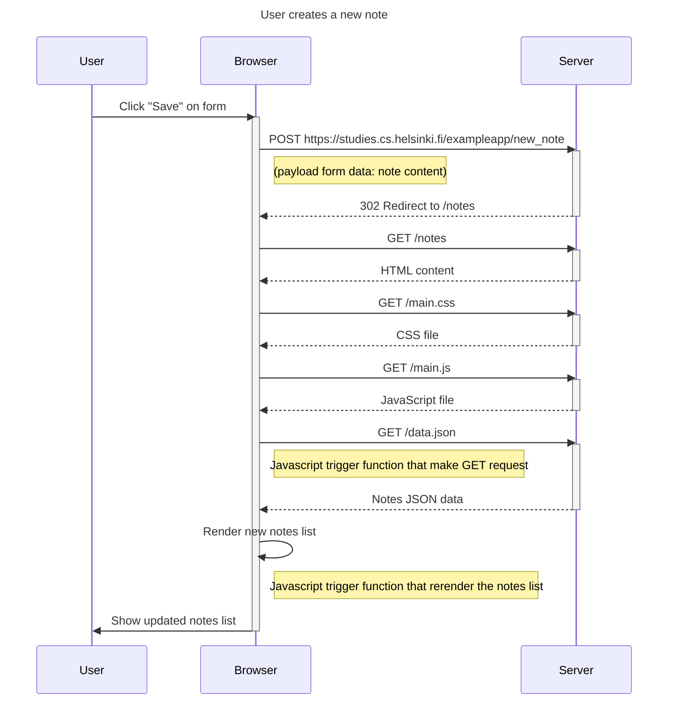

```mermaid
sequenceDiagram
title: User creates a new note
    participant User
    participant Browser
    participant Server

    User->>Browser: Click "Save" on form
    activate Browser
    Browser->>Server: POST https://studies.cs.helsinki.fi/exampleapp/new_note
    activate Server
    Note right of Browser: (payload form data: note content)
    Server-->>Browser: 302 Redirect to /notes
    deactivate Server
    Browser->>Server: GET /notes
    activate Server
    Server-->>Browser: HTML content
    deactivate Server
    Browser->>Server: GET /main.css
    activate Server
    Server-->>Browser: CSS file
    deactivate Server
    Browser->>Server: GET /main.js
    activate Server
    Server-->>Browser: JavaScript file
    deactivate Server
    Browser->>Server: GET /data.json
    activate Server
    Note right of Browser: Javascript trigger function that make GET request
    Server-->>Browser: Notes JSON data
    deactivate Server
    Browser->>Browser: Render new notes list
    Note right of Browser: Javascript trigger function that rerender the notes list
    Browser->>User: Show updated notes list
    deactivate Browser
```