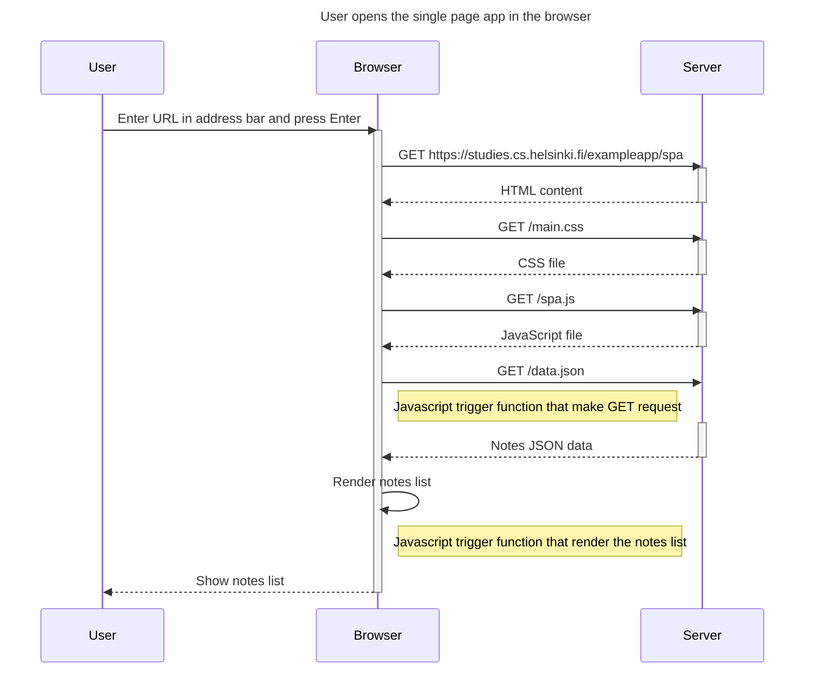

```mermaid
sequenceDiagram
title: User opens the single page app in the browser
    participant User
    participant Browser
    participant Server

    User->>Browser: Enter URL in address bar and press Enter
    activate Browser
    Browser->>Server: GET https://studies.cs.helsinki.fi/exampleapp/spa
    activate Server
    Server-->>Browser: HTML content
    deactivate Server
    Browser->>Server: GET /main.css
    activate Server
    Server-->>Browser: CSS file
    deactivate Server
    Browser->>Server: GET /spa.js
    activate Server
    Server-->>Browser: JavaScript file
    deactivate Server
    Browser->>Server: GET /data.json
    Note right of Browser: Javascript trigger function that make GET request
    activate Server
    Server-->>Browser: Notes JSON data
    deactivate Server
    Browser->>Browser: Render notes list
    Note right of Browser: Javascript trigger function that render the notes list
    Browser-->>User: Show notes list
    deactivate Browser
```