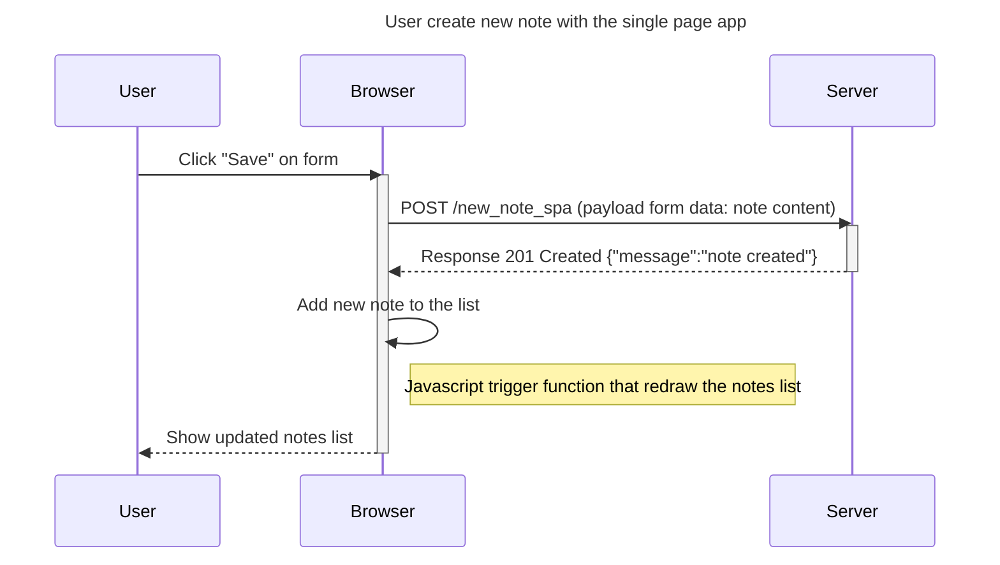

```mermaid
sequenceDiagram
title: User create new note with the single page app
    participant User
    participant Browser
    participant Server

    User->>Browser: Click "Save" on form
    activate Browser
    Browser->>Server: POST /new_note_spa (payload form data: note content)
    activate Server
    Server-->>Browser: Response 201 Created {"message":"note created"}
    deactivate Server
    Browser->>Browser: Add new note to the list
    Note right of Browser: Javascript trigger function that redraw the notes list
    Browser-->>User: Show updated notes list
    deactivate Browser
```